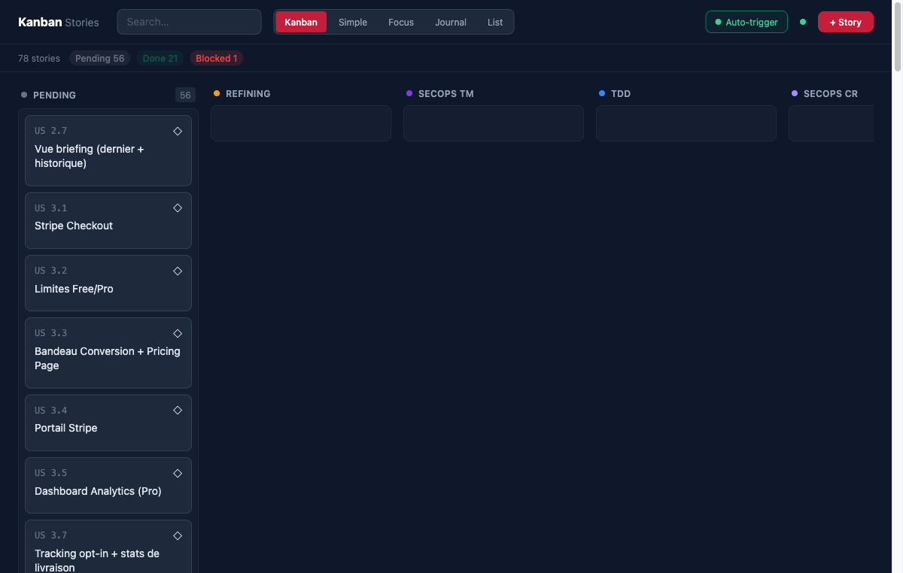
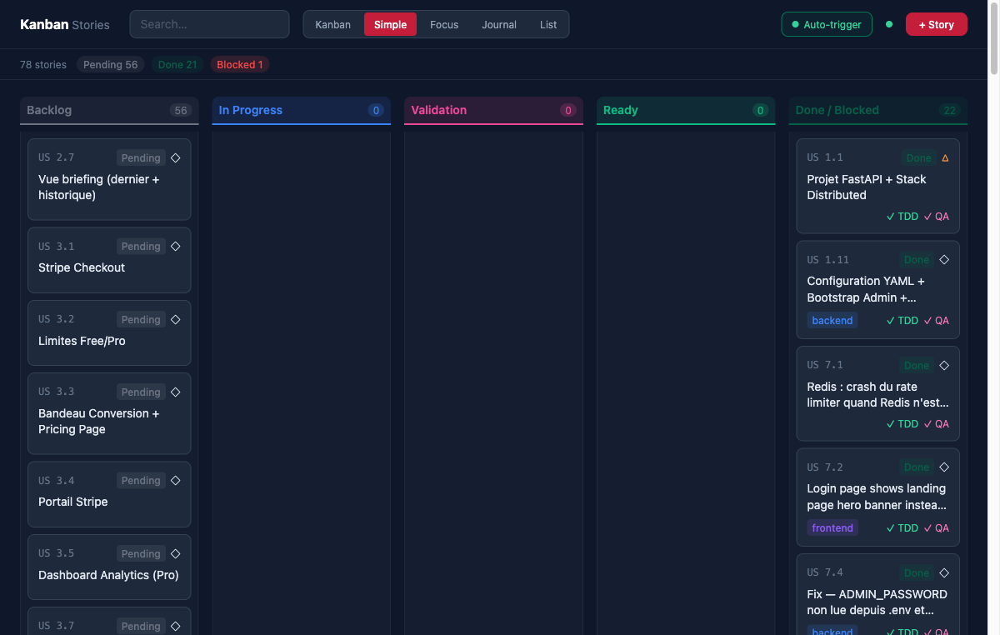
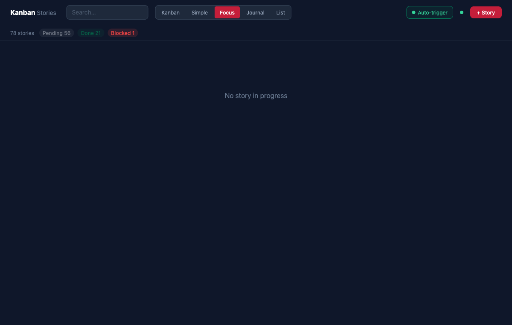
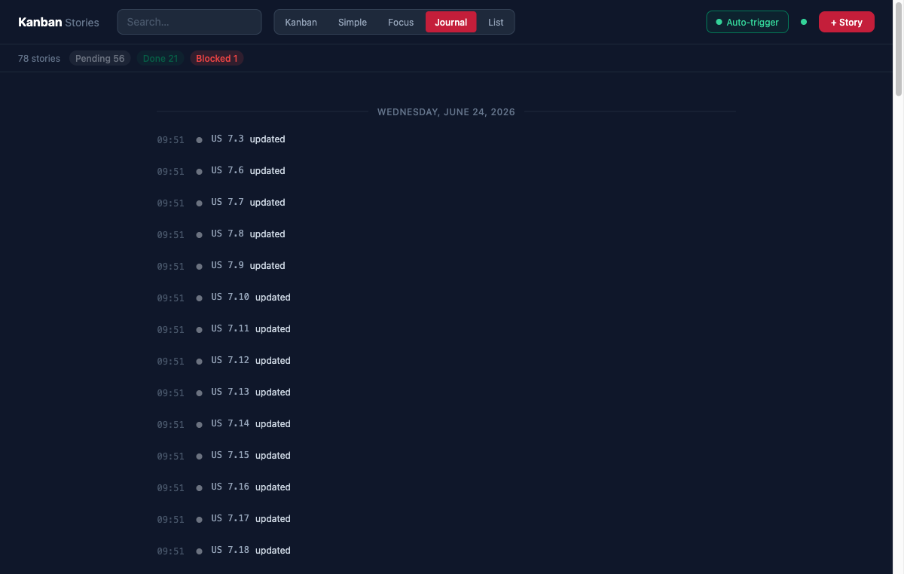
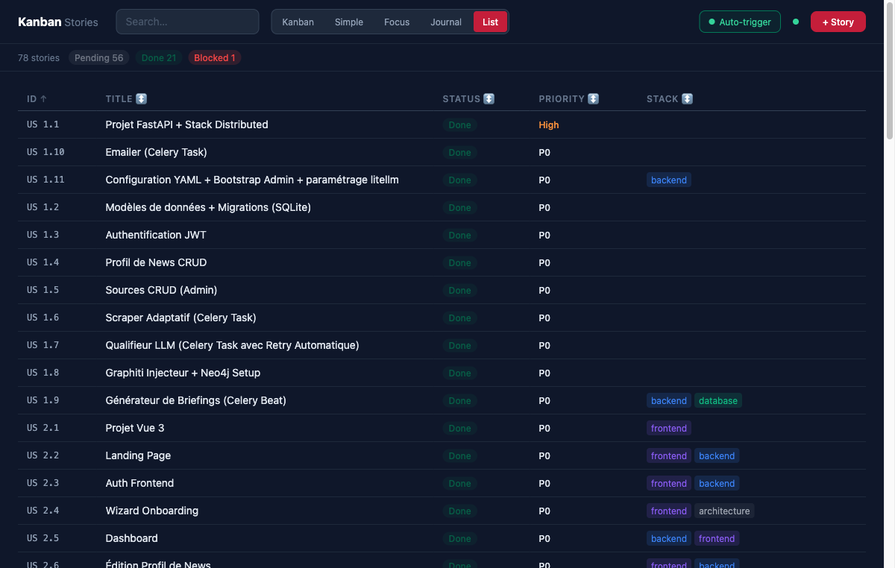
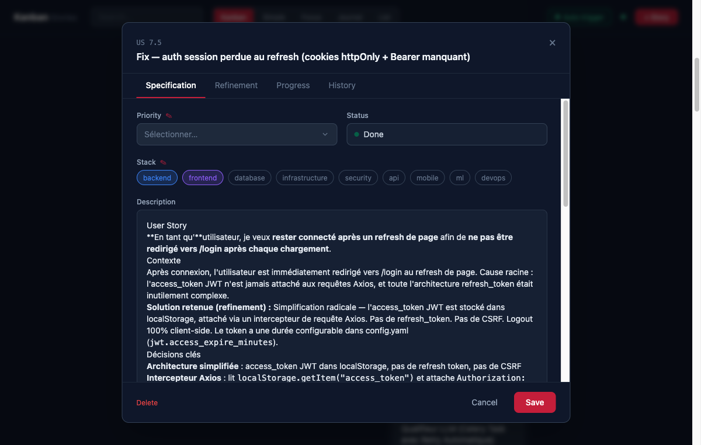
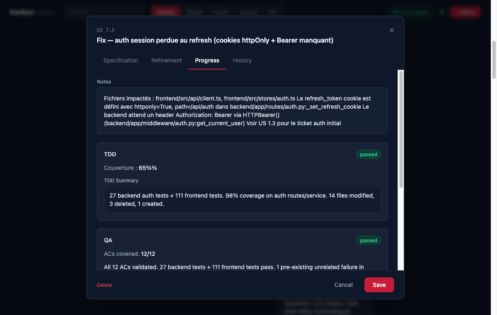
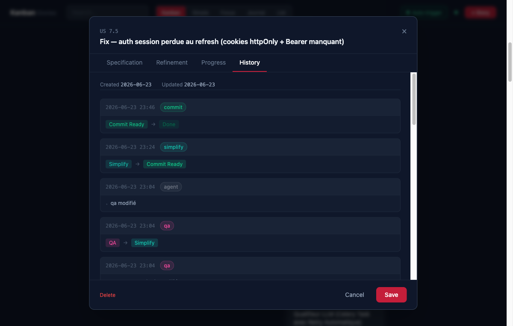

# opencode-config

Un template de configuration prêt à l'emploi pour [OpenCode](https://opencode.ai) qui donne à votre agent de développement IA un **pipeline structuré et traçable**.

Au cœur du système : un serveur Kanban qui fonctionne simultanément comme **tableau de bord web**, **API REST** et **serveur MCP** — permettant à l'agent de lire et mettre à jour l'état du projet, pendant que le développeur pilote depuis une interface drag-and-drop.

---

> [!CAUTION]
> ## ⛔ OBLIGATOIRE — Chaque instance OpenCode pilotable doit avoir un `--port` unique
>
> Le pont Kanban → OpenCode (injection de commandes via drag-and-drop) contacte l'API HTTP d'OpenCode.  
> **Sans `--port`, le tableau de bord ne peut pas piloter cette instance — elle tourne en mode MCP uniquement.**
>
> ```bash
> opencode --port 4096   # premier agent
> opencode --port 4097   # deuxième agent (port différent)
> ```
>
> Chaque instance doit utiliser un port différent. Le port est configurable via `OPENCODE_PORT` dans `.opencode/.env` (voir section [Configuration des ports](#configuration-des-ports)).

---

## Ce que ça apporte

- **Un tableau Kanban** connecté à l'agent via MCP — les stories avancent dans les colonnes au fil du travail
- **Un pont bidirectionnel** — déplacer une carte dans le tableau injecte une commande slash dans l'interface OpenCode
- **Des commandes slash** pour chaque étape du cycle de développement (raffinement, TDD, revue sécurité, QA, commit)
- **Des sous-agents isolés** pour le TDD, la QA, la revue SecOps et la simplification du code — chacun s'exécute dans son propre contexte avec les données de la story injectées
- **Un pipeline structuré** qui impose TDD, revue SecOps et validation QA avant chaque commit
- **Qualification des stories** — `/fix`, `/feature`, `/change` scannent le code et produisent un draft normalisé avant de persister

---

## Structure du dépôt

```
.opencode/
├── opencode.json          — Configuration MCP (lue par OpenCode)
├── package.json           — Dépendances Node (outillage optionnel)
├── .env.example           — Template de configuration des ports (copier en .env)
├── .env                   — Configuration locale des ports (gitignore, ne pas committer)
│
├── commands/              — Commandes slash (prompts injectés dans l'agent principal OpenCode)
│   ├── next-story.md      — Coordinateur : cycle complet ou étapes individuelles
│   ├── refine.md          — Raffinement : 8–12 questions, 4 rôles (PO/Architecte/Dev/DevSecOps)
│   ├── tdd.md             — Wrapper fin → lance le sous-agent tdd via Task tool
│   ├── secops.md          — Threat model (inline) + code review wrapper → lance le sous-agent secops-cr
│   ├── qa.md              — Wrapper fin → lance le sous-agent qa via Task tool
│   ├── simplify.md        — Lance 3 sous-agents simplify en parallèle via Task tool
│   ├── architect.md       — Conception architecture (cycle questions/réponses)
│   ├── review-pr.md       — Revue de PR GitHub et réponses
│   ├── commit.md          — Assistant commit conventionnel
│   ├── feature.md         — Créer une story de fonctionnalité avec phase de qualification
│   ├── fix.md             — Créer une story de bug avec phase de qualification
│   └── change.md          — Créer une story de modification avec analyse d'impact
│
├── agents/                — Sous-agents (mode: subagent, contexte isolé, permissions propres)
│   ├── tdd.md             — Cycle ROUGE/VERT/REFACTOR — écrit les tests en premier
│   ├── qa.md              — Validation des AC par tests d'intégration et E2E
│   ├── secops-cr.md       — Revue OWASP du code (read+bash uniquement, non-invasif)
│   ├── code-simplify-reuse.md
│   ├── code-simplify-quality.md
│   └── code-simplify-efficiency.md
│
└── kanban/                — Serveur Kanban MCP + tableau de bord Vue
    ├── server.py          — Serveur principal (FastAPI + FastMCP, sert dist/)
    ├── requirements.txt
    ├── migrate.py         — Migration de schéma pour les stories existantes
    ├── screenshots/       — Captures d'écran du tableau de bord
    ├── dist/              — Application Vue compilée (servie par FastAPI sur /)
    │   ├── index.html
    │   └── assets/        — Bundles JS + CSS (hachés par Vite)
    └── frontend/          — Source Vue 3 (modifier ici, puis npm run build)
        ├── package.json
        ├── vite.config.js
        ├── tailwind.config.js
        └── src/
            ├── App.vue
            ├── api.js
            ├── constants.js
            └── components/
                ├── KanbanBoard.vue
                ├── SimpleView.vue
                ├── FocusView.vue
                ├── JournalView.vue
                ├── ListView.vue
                ├── StoryModal.vue
                ├── KanbanCard.vue
                ├── StatsBar.vue
                └── MarkdownContent.vue
```

Les données des stories vivent **en dehors** de ce dépôt, dans `user-stories/*.json` à la racine du projet — un fichier JSON par story, servis par le serveur Kanban.

---

## Démarrage rapide

### 1. Installer les dépendances Python

```bash
pip install -r .opencode/kanban/requirements.txt
```

### 2. Compiler le tableau de bord (première fois uniquement)

Le dossier `dist/` est inclus dans le dépôt et prêt à l'emploi. Pour recompiler après modification du frontend Vue :

```bash
cd .opencode/kanban/frontend
npm install   # première fois seulement
npm run build # sortie → ../dist/
```

Pour le développement avec rechargement à chaud (proxy vers le backend sur `:8765`) :

```bash
npm run dev   # serveur Vite sur http://localhost:5173
```

### 3. Démarrer le serveur Kanban

**Ne jamais lancer le serveur manuellement.** OpenCode le démarre automatiquement comme sous-processus MCP. Un processus lancé à la main deviendrait orphelin (PPID=1) et survivrait aux redémarrages d'OpenCode avec du code périmé.

OpenCode lance :
```bash
python .opencode/kanban/server.py --mcp --debug
```

Ce processus gère simultanément le transport MCP (stdio) et le serveur HTTP (port `KANBAN_HTTP_PORT`, défaut 8765) dans le même processus. **Dashboard : `http://localhost:8765`**

Pour redémarrer le serveur : quitter et relancer OpenCode.

### 4. Configurer OpenCode

Le fichier `opencode.json` à la racine de ce dépôt connecte déjà le serveur Kanban comme fournisseur MCP :

```json
{
  "$schema": "https://opencode.ai/config.json",
  "mcp": {
    "kanban": {
      "type": "local",
      "command": ["python", ".opencode/kanban/server.py", "--mcp", "--debug"],
      "enabled": true
    }
  }
}
```

Copiez-le à la racine de votre projet (ou fusionnez avec votre `opencode.json` existant).

### 5. Configuration des ports

Copiez `.opencode/.env.example` en `.opencode/.env` et ajustez :

```bash
cp .opencode/.env.example .opencode/.env
```

```bash
# .opencode/.env
KANBAN_HTTP_PORT=8765   # port du dashboard et de l'API REST
OPENCODE_PORT=4096      # port de repli — psutil détecte automatiquement le port parent en multi-instance
```

Le fichier `.opencode/.env` est chargé au démarrage du serveur. Les variables d'environnement du shell ont priorité sur le fichier.

> **Note multi-instance** : avec plusieurs instances OpenCode, `OPENCODE_PORT` n'est utilisé qu'en dernier recours. Le serveur découvre le bon port en inspectant les sockets TCP du processus parent via `psutil` — aucune configuration `.env` par instance n'est nécessaire.

> ⚠️ **Le fichier `.opencode/.env` est gitignore** (couvert par la règle `.env` à la racine). Ne le committez jamais — il peut contenir des valeurs locales.

### 6. Ajouter vos conventions projet

Les commandes référencent `AGENTS.md` à la racine du projet pour les détails spécifiques à votre stack (runner de tests, commandes lint, chemins de fichiers, design system). Créez-en un si vous n'en avez pas — voir la section [Template AGENTS.md](#template-agentsmd) ci-dessous.

---

## Support multi-instance

Plusieurs instances OpenCode peuvent tourner simultanément sur le même tableau Kanban. Les fichiers JSON des stories sont protégés par un verrou exclusif (`fcntl.flock`) pour éviter les corruptions lors des écritures concurrentes.

### Auto-promotion (élection du maître HTTP)

Au démarrage, le sous-processus serveur Kanban tente de lier `KANBAN_HTTP_PORT` (défaut `8765`) :
- La **première instance** qui réussit devient le maître HTTP — elle sert le dashboard et l'API REST.
- Les **instances suivantes** détectent que le port est occupé et tournent en mode MCP uniquement, en lançant un watchdog de 10 secondes.
- Si l'instance maître s'arrête, le prochain cycle de watchdog promeut automatiquement une des instances restantes.

Le dashboard reste accessible sur `http://localhost:8765` tant qu'au moins une instance tourne.

### Registre de sessions et découverte de port

Chaque instance s'enregistre dans `.kanban-sessions.json` à la racine du projet au démarrage et se désinscrit à l'arrêt propre. Les PIDs morts sont purgés automatiquement à chaque lecture de `/api/sessions`.

```json
{
  "63830": { "opencode_port": 4096, "routable": true,  "started": "2026-06-25T20:15:05" },
  "64951": { "opencode_port": 4097, "routable": true,  "started": "2026-06-25T20:15:15" },
  "65100": { "opencode_port": null,  "routable": false, "started": "2026-06-25T20:16:00" }
}
```

Le champ `routable` vaut `true` uniquement si un serveur HTTP OpenCode était joignable au démarrage. Les instances lancées sans `--port` sont enregistrées avec `routable: false` et `opencode_port: null`.

**Découverte du port** : la bibliothèque `psutil` inspecte les sockets TCP en écoute du processus parent (PPID) directement. C'est le seul mécanisme fiable quand plusieurs instances tournent sur des ports différents — chaque sous-processus Kanban trouve le port exact de *son propre* OpenCode sans deviner. `psutil` est donc une dépendance obligatoire (`pip install -r .opencode/kanban/requirements.txt`). Le `OPENCODE_PORT` du `.env` n'est utilisé qu'en repli si l'inspection du processus échoue.

### Routage des commandes

Quand une action manuelle du dashboard (déplacement de carte, bouton trigger) doit atteindre une instance OpenCode, le serveur sélectionne automatiquement la meilleure session disponible :

1. **Préfère une session idle** — une instance routable qui ne traite pas de commande en ce moment
2. **Repli vers n'importe quelle session routable** si toutes sont occupées

Déplacer deux cartes rapidement distribue donc naturellement les commandes entre vos instances. Les commandes émises par les agents via les outils MCP (`kanban-move-story`) court-circuitent ce routage — elles n'injectent pas de commande slash.

### Indicateur de sessions dans le dashboard

L'en-tête du dashboard affiche un badge de sessions en temps réel :

- **●** — point vert quand le flux SSE est connecté (dashboard ↔ serveur Kanban)
- **N** — nombre total de sessions vivantes
- **⟳ P** — badge ambre animé indiquant combien de sessions traitent une commande (visible seulement si P > 0)

Cliquer sur le badge ouvre un **popover de sessions** avec les détails par instance : PID, port, statut routable, état de traitement en cours, et heure de démarrage relative.

**Blocage des actions manuelles** : quand aucune session n'est connectée (`N = 0`), les drags inter-colonnes et les boutons trigger sont désactivés. Le réordonnancement au sein d'une même colonne (tri du backlog) reste toujours autorisé.

### Configuration recommandée

| Objectif | Commande |
|----------|---------|
| Un agent pilotable | `opencode --port 4096` |
| Deux agents pilotables | `opencode --port 4096` + `opencode --port 4097` |
| Agent MCP uniquement | `opencode` (non pilotable — le dashboard ne peut pas injecter de commandes) |

> ⚠️ **Collision de port** : Chaque instance OpenCode a besoin d'un `--port` distinct. Tenter de lancer deux instances avec le même port fera échouer le démarrage de la seconde.

### Isolation par projet

Chaque projet utilise un `KANBAN_HTTP_PORT` indépendant dans son `.opencode/.env`. Le registre de sessions est propre au projet — plusieurs projets ne partagent jamais leur état.

```bash
# Projet A : .opencode/.env
KANBAN_HTTP_PORT=8765
OPENCODE_PORT=4096

# Projet B : .opencode/.env
KANBAN_HTTP_PORT=8766
OPENCODE_PORT=4098
```

---

## Le pipeline

Chaque user story suit une séquence fixe d'étapes. L'agent suit lui-même sa position ; le développeur peut observer ou intervenir depuis le tableau de bord.

```
pending → refining → secops_tm → tdd → secops_cr → qa → simplify → commit_ready → completed
```

| Étape | Ce qui se passe |
|-------|----------------|
| `pending` | La story attend — pas encore raffinée |
| `refining` | `/refine` challenge les AC via un dialogue de 8–12 questions |
| `secops_tm` | `/secops mode=threat-model` identifie les surfaces d'attaque avant le code |
| `tdd` | Le sous-agent `tdd` implémente la story avec Rouge → Vert → Refactor |
| `secops_cr` | Le sous-agent `secops-cr` audite le diff contre une checklist OWASP |
| `qa` | Le sous-agent `qa` valide chaque AC avec des tests d'intégration ou E2E |
| `simplify` | 3 sous-agents passent le code en revue en parallèle (qualité, réutilisabilité, efficacité) |
| `commit_ready` | Le développeur approuve le message de commit |
| `completed` | Story committée et terminée |

Lancer le cycle complet :

```
/next-story US X.Y
```

Ou piloter les étapes individuelles depuis le tableau de bord en déplaçant les cartes — le serveur injecte automatiquement la bonne commande dans OpenCode.

---

## Trois modes d'interaction

Le même pipeline peut être piloté de trois façons, avec des niveaux d'automatisation différents :

### 1. `/next-story US X.Y` — Entièrement automatique

Le pipeline s'exécute de bout en bout avec un minimum d'interruptions :
- Les sous-agents s'exécutent en séquence, chacun reçoit le contexte de la story via injection dans le Task tool
- **2 points d'arrêt fixes** : après le raffinement (avant le code) et avant le commit
- **1 arrêt conditionnel** : si la QA échoue — le développeur décide comment continuer
- Les sous-agents ne demandent pas à passer à l'étape suivante

### 2. Commandes manuelles — Étape par étape

`/tdd US X.Y`, `/qa US X.Y`, `/secops US X.Y mode=code-review`, etc.

Chaque commande exécute une seule étape, puis demande :
> "✅ Terminé — passer à [étape suivante] ? [yes / no]"

Cela donne un contrôle granulaire pour inspecter les résultats entre les étapes.

### 3. Drag-and-drop sur le tableau de bord

Chaque déplacement de colonne passe par `/next-story` avec le sous-commande correspondant :

| Colonne de destination | Commande injectée |
|------------------------|-------------------|
| `refining` | `/next-story refine US X.Y` |
| `secops_tm` | `/next-story secops-tm US X.Y` |
| `tdd` | `/next-story implement US X.Y` |
| `secops_cr` | `/next-story secops-cr US X.Y` |
| `qa` | `/next-story qa US X.Y` |
| `simplify` | `/next-story simplify US X.Y` |
| `commit_ready` | `/next-story commit US X.Y` |

---

## Vues du tableau de bord

Le tableau de bord sur `http://localhost:8765` propose cinq vues, accessibles depuis l'en-tête :

| Vue | Bouton | Description |
|-----|--------|-------------|
| **Kanban** | `Kanban` | Tableau complet à 10 colonnes — une colonne par statut du pipeline. Glisser les cartes entre colonnes déclenche la commande correspondante dans OpenCode. |
| **Simple** | `Simple` | 5 méta-colonnes (Backlog / In Progress / Validation / Ready / Done). Un déplacement inter-colonne déplace la story vers le statut cible du groupe. |
| **Focus** | `Focus` | Affiche la story active (la plus récemment déplacée, non pending/done) sous forme de barre de progression du pipeline. |
| **Journal** | `Journal` | Chronologie d'activité globale — toutes les entrées d'historique de toutes les stories, groupées par date. |
| **List** | `List` | Tableau trié de toutes les stories (ID, titre, statut, dernière mise à jour, stack) avec filtres par statut et par stack. Le tri par statut suit l'ordre du pipeline. |

Toutes les vues partagent la même barre de recherche (filtre par ID, titre ou tag stack) et ouvrent le même modal d'édition au clic.

### Captures d'écran

**Vue Kanban** — tableau 10 colonnes avec drag-and-drop :


**Vue Simple** — 5 méta-colonnes :


**Vue Focus** — suivi de la story active dans le pipeline :


**Vue Journal** — historique d'activité global :


**Vue List** — tableau trié :


**Modal — onglet Spécification** :


**Modal — onglet Avancement** (TDD, QA, SecOps, Simplify) :


**Modal — onglet Historique** (audit trail avec timestamps) :


### Modal d'édition

Le modal propose quatre onglets :

| Onglet | Contenu | Modifiable ? |
|--------|---------|--------------|
| **Specification** | Titre, statut, stack, description, critères d'acceptation. Les stories `pending` affichent leur position dans le backlog (#n / total). | ✅ |
| **Refinement** | Décisions de raffinement, guide d'implémentation | Lecture seule (généré par l'agent, rendu Markdown) |
| **Progress** | Notes, TDD (statut/tests/couverture), QA, rapport SecOps, résumé Simplify | Mixte |
| **History** | Journal d'audit append-only de la story | Lecture seule |

---

## Commandes vs Agents

OpenCode distingue deux concepts :

| | Commandes | Agents |
|--|-----------|--------|
| Définis dans | `commands/*.md` | `agents/*.md` |
| Contexte | Injecté dans l'**agent principal** | **Isolé** — fenêtre de contexte propre |
| Invocation | `/nom-commande` par l'utilisateur | Task tool (`subagent_type`) par une commande |
| Outil `question` | ✅ Disponible | ❌ Non disponible |
| Permissions | Héritées de l'agent principal | Définies dans le frontmatter de l'agent |
| Usage | Orchestration, Q&A interactif | Exécution avec contexte isolé et injecté |

**Ce que ça implique en pratique :**

- `refine.md` et `secops.md` (mode threat-model) restent des **commandes** — ils ont besoin de l'outil `question` pour le dialogue interactif
- `tdd.md`, `qa.md`, `secops.md` (mode code-review) sont des **wrappers fins** : ils assemblent le contexte (JSON story + AGENTS.md), puis lancent leur sous-agent correspondant via Task tool
- Les sous-agents reçoivent tout leur contexte dans le prompt du Task tool — ils ne lisent pas `$ARGUMENTS` directement

---

## Communication bidirectionnelle

Le serveur Kanban est l'**état partagé** entre le développeur et l'agent.

```
Développeur (tableau de bord)     Agent (OpenCode)
       │                               │
       │  drag carte → colonne         │
       │────────────────────────────▶  │
       │   POST /tui/submit-prompt     │
       │   → /next-story refine US X   │
       │                               │
       │                    Appel MCP  │
       │  ◀────────────────────────────│
       │  kanban-move-story(US X, tdd) │
       │  kanban-update-story(...)     │
       │                               │
       │  SSE : data: refresh          │
       │────────────────────────────▶  │
       │  (tableau se rafraîchit)      │
```

Règle clé : **les déplacements faits par l'agent ne déclenchent pas de commandes** (les agents avancent d'eux-mêmes). Seuls les drags humains déclenchent l'injection de commandes.

---

## Outils MCP

Le serveur Kanban expose 8 outils :

| Outil | Description |
|-------|-------------|
| `kanban-get-story` | Lire une story complète avec tous ses champs |
| `kanban-list-stories` | Lister les stories, filtrées par statut ou phase |
| `kanban-update-story` | Mise à jour partielle (résultats TDD, AC, guide d'implémentation…) |
| `kanban-move-story` | Déplacer une story vers une nouvelle colonne + log de la transition |
| `kanban-create-story` | Créer une nouvelle story — toujours avec `status: pending` |
| `kanban-get-next-pending` | Obtenir la prochaine story en attente (`priority_score` d'abord, puis P0→P1→P2→phase) |
| `kanban-bulk-prioritize` | Fixer les scores de priorité sur N stories en un seul appel |
| `kanban-get-stats` | Obtenir les compteurs globaux du pipeline |

Voir [`kanban/README.md`](kanban/README.md) pour le schéma complet, les règles de fusion et la référence du debug logging.

Le serveur expose également des endpoints REST consommés par le dashboard :

| Méthode | Endpoint | Description |
|---------|----------|-------------|
| `PATCH` | `/api/stories/{sid}/move` | Déplacer une story vers un nouveau statut (body : `{ status, actor }`) |
| `POST` | `/api/stories/{sid}/trigger` | Déclencher la commande OpenCode pour le statut actuel de la story sans la déplacer |
| `GET` | `/api/history` | Historique agrégé de toutes les stories, trié par timestamp desc |
| `POST` | `/api/reorder` | Réordonner les cartes dans une colonne (body : `{ status, order: [ids] }`) |
| `GET` | `/api/events` | Flux SSE — envoie `data: refresh` à chaque changement de story |
| `GET` | `/api/stats` | Compteurs globaux du pipeline |
| `POST` | `/api/reload` | Invalider le cache (recharge les fichiers écrits directement sur disque) |
| `GET` | `/api/debug` | 50 derniers événements de déclenchement (diagnostic) |
| `GET` | `/api/sessions` | Registre de sessions actives — `{ pid: { opencode_port, routable, started } }`, PIDs morts purgés à la lecture |
| `GET` | `/api/opencode/status` | Statut OpenCode agrégé — `{ busy, total, processing }` sur toutes les sessions vivantes |

---

## Référence des commandes

Toutes les commandes sont agnostiques à la stack. Elles référencent `AGENTS.md` dans votre projet pour les noms d'outils, chemins de fichiers et conventions.

| Commande | Rôle |
|----------|------|
| `/next-story` | Afficher le statut du projet et la prochaine story en attente |
| `/next-story US X.Y` | Lancer le pipeline complet pour une story (2 points d'arrêt) |
| `/refine US X.Y` | Challenger les AC via un dialogue structuré (4 rôles, 8–12 questions via l'outil `question`) |
| `/tdd US X.Y` | Assembler le contexte → lancer le sous-agent `tdd` → gérer l'avancement |
| `/secops US X.Y` | Threat model (inline, interactif) ou code review (lance le sous-agent `secops-cr`) |
| `/qa US X.Y` | Assembler le contexte → lancer le sous-agent `qa` → gérer l'avancement |
| `/simplify [US X.Y]` | Lancer 3 sous-agents en parallèle, corriger les trouvailles, persister le rapport |
| `/architect` | Concevoir une fonctionnalité avant d'implémenter (cycle questions/réponses) |
| `/review-pr [numéro]` | Récupérer les commentaires GitHub PR, classer, corriger, répondre |
| `/commit` | Proposer et créer un commit conventionnel |
| `/feature "..."` | Qualifier (scan + titre + description + stack) → preview → créer story pending |
| `/fix "..."` | Qualifier le bug (scan + titre "Fix — " + Bug/Contexte/Attendu + stack) → créer pending |
| `/change "..."` | Qualifier le changement (scan impact + Motivation/Périmètre/Risques + stack) → créer pending |

---

## Création et qualification des stories

`/fix`, `/feature` et `/change` exécutent une **phase de qualification** avant de créer la story :

1. **Scan du contexte** — grep dans le code, `kanban-list-stories` (pour `/change`), lecture de `AGENTS.md`
2. **Remplissage du schéma** :

| Champ | Règle |
|-------|-------|
| `title` | Normalisé, ≤60 chars, format propre au type (voir ci-dessous) |
| `description` | Template propre au type (voir ci-dessous) |
| `stack` | Inféré depuis le scan du code — toujours rempli |
| `notes` | Contexte de reproduction, stories impactées, questions ouvertes |

3. **Preview + confirmation** — un seul bloc de confirmation avant de persister
4. **Création** — `kanban-create-story` (titre, priorité, phase) puis `kanban-update-story` (description, stack, notes)

**Formats de titre :**

| Commande | Format | Exemple |
|----------|--------|---------|
| `/feature` | Verbe impératif + sujet | `"Exporter les briefings en CSV"` |
| `/fix` | `"Fix — [description du bug]"` | `"Fix — refresh token expiré prématurément"` |
| `/change` | `"Change — [ce qui change]"` | `"Change — migration SQLite vers PostgreSQL"` |

**Templates de description :**

- `/feature` → `"En tant que [rôle], je veux [feature], afin de [bénéfice]."`
- `/fix` → `"**Bug:** [...]. **Contexte:** [...]. **Attendu:** [...]."` (3 parties)
- `/change` → `"**Motivation:** [...]. **Périmètre:** [...]. **Risques:** [...]."` (3 parties)

---

## Template AGENTS.md

Les commandes attendent un `AGENTS.md` à la racine de votre projet avec au minimum :

```markdown
## Commandes Dev

### Backend (`cd backend`)
| Commande | Action |
|----------|--------|
| `<commande de tests>` | Lancer les tests |
| `<commande lint>` | Lint |
| `<commande typecheck>` | Vérification des types |

### Frontend (`cd frontend`)
| Commande | Action |
|----------|--------|
| `<commande de tests>` | Lancer les tests |
| `<commande lint>` | Lint |

## Quality Gates

### Avant chaque commit
```bash
<lint + typecheck backend>
<lint + typecheck frontend>
```

### Avant chaque push / PR
```bash
<tests backend avec couverture>
<tests frontend avec couverture>
<tests E2E>
```
```

---

## Schéma JSON d'une story

Chaque story est stockée dans `user-stories/us-X-Y.json` :

```jsonc
{
  "id": "US 1.3",
  "phase": 1,
  "phase_name": "...",
  "title": "...",
  "description": "...",        // rempli par /feature, /fix, /change ou /refine
  "status": "pending",
  "order": 0,                  // position dans la colonne (drag-and-drop)
  "priority_score": 0,         // 0–100, défini par kanban-bulk-prioritize. Plus élevé = traité en premier dans le backlog
  "stack": ["backend"],        // rempli par /feature, /fix, /change ou /refine
  "acceptance_criteria": [
    {"id": 1, "text": "...", "checked": false}
  ],
  "tdd": {"status": "pending", "tests": 0, "coverage": "0%", "notes": ""},
  "qa":  {"status": "pending", "ac_covered": "0/0", "notes": "", "ac_failures": []},
  "implementation_guide": {},  // rempli par /refine
  "refine_decisions": [],      // rempli par /refine
  "secops_report": {},         // rempli par /secops (les deux modes)
  "simplify_comments": "",     // rempli par /simplify
  "notes": "",
  "history": [],               // journal d'audit — append-only
  "created_at": "2026-06-24T14:00:00",  // ISO datetime, géré par le serveur
  "updated_at": "2026-06-24T14:00:00"   // ISO datetime, géré par le serveur
}
```

---

## Licence

MIT — utilisation, fork et adaptation libres.
